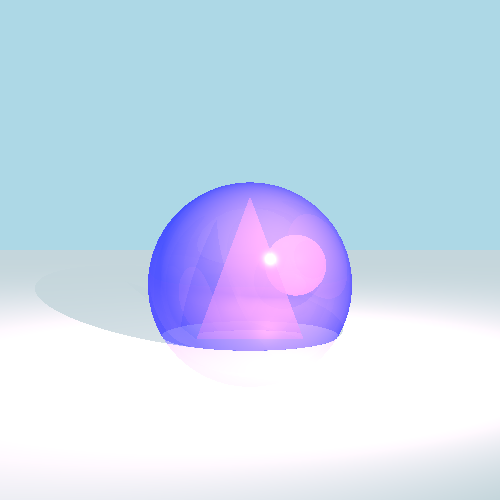
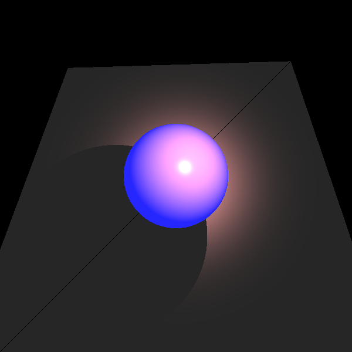
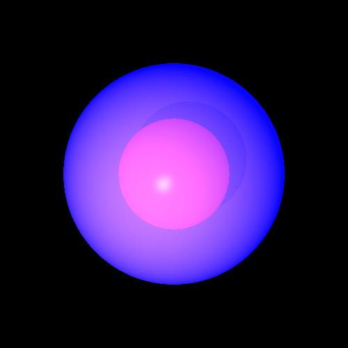

# Advanced 3D Graphics Rendering Engine in Java

## Project Overview
  

<em>This image showcases a complete scene rendered by the engine, featuring advanced lighting, shadows, reflections, and transparency effects.</em>

Developed an advanced Java-based 3D rendering engine as part of a Software Engineering course. The engine simulates realistic virtual scenes with complex lighting calculations, shadows, reflections, and transparency. The project emphasizes high code quality, scalability, and efficient architecture, demonstrating a deep understanding of object-oriented programming, graphics, and modern development methodologies.

## Core Functionality
- **Geometric Structures and Ray Intersection**  
    
  
<em>Illustration of various geometric shapes (spheres, planes, triangles) and precise ray intersection handling.</em>
  
  The engine supports the construction of multiple 3D objects with accurate ray-tracing algorithms, crucial for realistic scene composition.

- **Advanced Lighting System**  
    
  
<em>Demonstration of ambient lighting, shadows, specular highlights, and reflective surfaces.</em>
  
  The lighting effects are based on the Phong reflection model and include:
  - *Ambient Light*: Uniform lighting that illuminates all objects equally.
  - *Diffuse Lighting*: Surface light scattering that adds depth.
  - *Specular Highlights*: Shiny reflections that make glossy materials appear realistic.
  - *Shadows*: Accurate casting of shadows for a true-to-life look.
  - *Transparency and Reflection*: Recursive ray tracing for realistic light behavior through transparent materials and reflective surfaces.

- **Complex Scene Rendering**  
    
  
<em>A high-resolution render combining multiple lighting and reflection techniques.</em>
  
  The engine can render visually rich and immersive scenes, bringing together various lighting effects and detailed reflections.

## Development Methodologies
- **Extreme Programming (XP)**: Agile, collaborative approach to ensure quality and flexibility.
- **Test-Driven Development (TDD)**: Wrote comprehensive unit tests (JUnit) before implementation to validate functionality.
- **Responsibility-Driven Design (RDD)**: Organized responsibilities among classes to improve design and maintainability.
- **Refactoring**: Continuous improvement of code structure for performance and maintainability.

## Design Patterns Like
- **Composite**: Structured geometric objects hierarchically for efficient ray-intersection management.
- **Builder**: Constructed complex objects, like scenes and lighting configurations, flexibly and maintainably.
- **Marker Interface**: Used for uniform object cloning (e.g., Cloneable).
- **Wrapper**: Enhanced color handling through a wrapper class integrated with the Java AWT library.

## Technologies & Tools
- **Language**: Java
- **Testing Framework**: JUnit 5
- **Version Control**: GitHub
- **Development Environment**: IntelliJ IDEA
- **Agile Practices**: Pair Programming, Continuous Integration

## Why This Project Stands Out
This 3D rendering engine demonstrates a combination of strong software engineering principles, a deep understanding of 3D graphics, and a commitment to producing clean, efficient, and scalable code. The project highlights my ability to tackle complex algorithms, use design patterns effectively, and work collaboratively in a structured development environment.

## Getting Started
To explore the engine:
1. Clone the repository: `git clone <repository-url>`
2. Open the project in IntelliJ IDEA or your preferred IDE.
3. Build and run the project, and experiment with rendering different scenes.

## Contact
I'm always excited to discuss opportunities and share more about this project. Feel free to reach out on [LinkedIn](https://www.linkedin.com/in/noam-mandelbaum-9443471b9/) or via email at [noam.mandelbaum@gmail.com].
